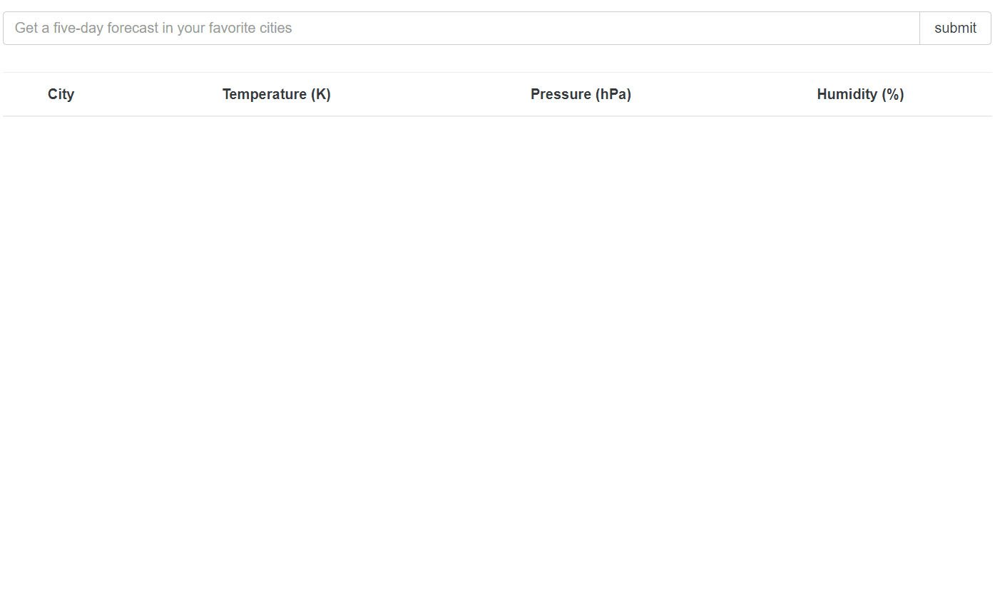

# Search Weather with ReactJS with Redux.

This is an app created to Search the weather from a City, is made with ReactJS with Redux.

`You need to know, this key has a billing method to work.`



You can see this alive, [Click here](https://mysterious-chamber-87993.herokuapp.com/).

This Project is part of the Udemy course - Modern React with Redux by Stephen Grider

## Getting Started

Click in the download button and get the .zip file. Extract the contents of the zip file.

Or can clone this repository, just copy the git url and open your terminal and run git clone + repository url:

```
git clone https://github.com/ejgdev/search-weather-react-redux.git
```

### Prerequisites

It is necessary to have installed a package manager like npm or yarn.

- [NodeJS website](https://nodejs.org/).
- [Yarn website](https://yarnpkg.com/).

Another prerequisite is have your own OpenWeatherMap Api Key, just sign up in [openweathermap.org](https://openweathermap.org/forecast5), when is successful, you will see your api key below of your username, email, fullname.

Then create your own `.env` file and paste the Api Key, you can see the `.env.default` file for reference.
### Installing

For install this repository, just need to run this command:

```
npm install
```
### Optional

This project have configured a linter, just need installed a linter package in your text code editor.

In atom you can use this [package](https://atom.io/packages/linter-eslint).

### Start the Project
When everything is setup, you can run the project with this command:

```
npm start
```
Then open http://localhost:3000/ to see your app. By default run on port 3000.

## Deployment

There are differents way to Deployment.

If you want use Heroku, you can follow this [article](https://devcenter.heroku.com/articles/git).

When your heroku app is created, just need deploy with this command:

```
git push heroku master
```

### Google maps in production status

If you want handle Google maps in Deployment, You need an Google map Api key and add to `.env` file.

You need to know, this key has a billing method to work.
